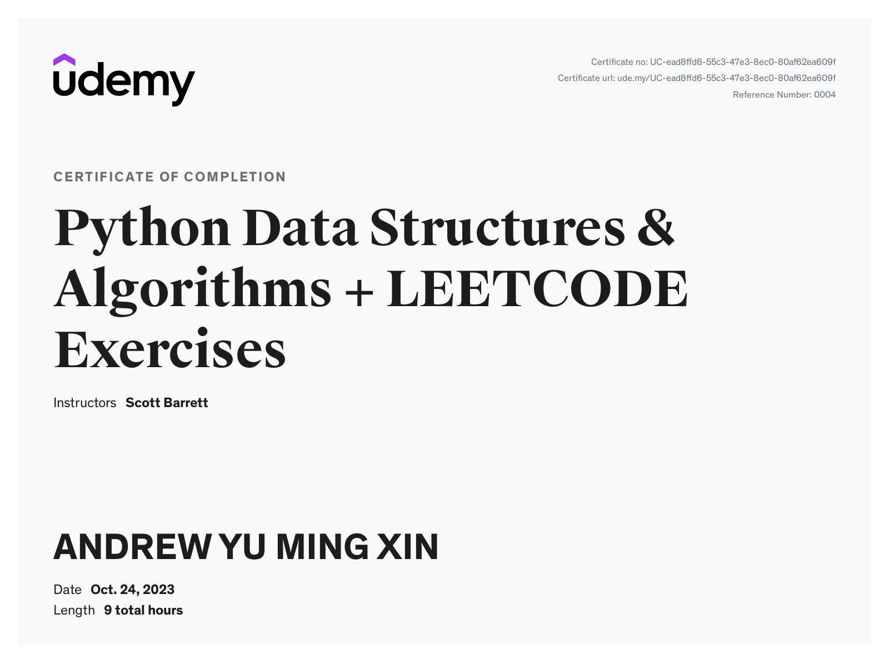

This certificate above verifies that ANDREW YU MING XIN successfully completed the course 
[Python Data Structures & Algorithms + LEETCODE Exercises](https://www.udemy.com/course/data-structures-algorithms-python/) on 10/24/2023 as taught by Scott Barrett on Udemy. 
The certificate indicates the entire course was completed as validated by the student. 
The course duration represents the total video hours of the course at time of most recent completion.
