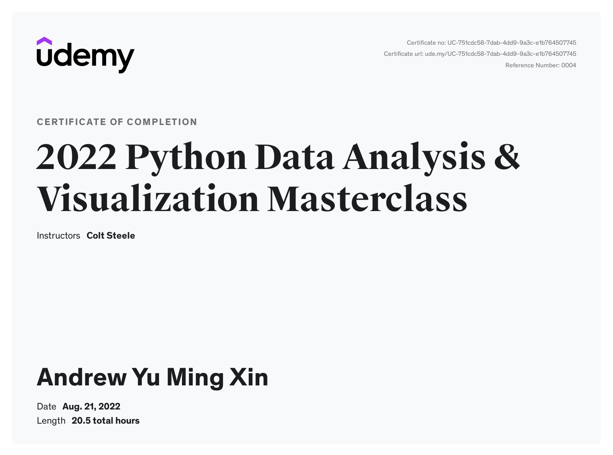

Text datasets can be in .csv/.json/sql

[Open datasets to play with](https://www.kaggle.com/datasets)

This certificate above verifies that Andrew Yu Ming Xin successfully completed the course
[2022 Python Data Analysis & Visualization Masterclass](https://www.udemy.com/course/python-data-analysis-visualization/) on 08/21/2022 as taught by Colt Steele on Udemy.
The certificate indicates the entire course was completed as validated by the student. 
The course duration represents the total video hours of the course at time of most recent completion.

- [Exercise 1](Exercise_1_Jupyter_Basics.ipynb):
- [Exercise 2](Exercise_2_Dataframe_Basics.ipynb):
- [Exercise 3](Exercise_3_DF_Analysis.ipynb):
- [Exercise 4](Exercise_4_Series.ipynb):
- [Exercise 5](Exercise_5_Indexes_Sorting.ipynb):
- [Exercise 6](Exercise_6_Filtering.ipynb):
- [Exercise 7](Exercise_7_Adding_Removing_Columns.ipynb):
- [Exercise 8](Exercise_8_Updating_Data.ipynb):
- [Exercise 9](Exercise_9_Types_NaN.ipynb):
- [Exercise 10](Exercise_10_Dates.ipynb):
- [Exercise 11](Exercise_11_Matplotlib.ipynb):
- [Exercise 12](Exercise_12_Pandas_Plotting.ipynb):
- [Exercise 13](Exercise_13_GroupBy.ipynb):
