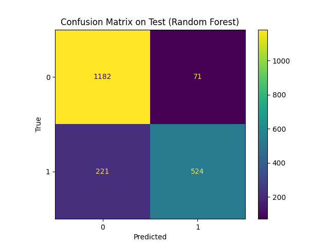

If "distribution not found" due to different environment and therefore different versions of libraries while installing requirements.txt, specify versions as >= as less strict

### Learning Outcomes

Within this project, I believe I have exhibited the following

There are synthetic features in the dataset. Therefore, I stated and verified any assumptions that I made clearly.

1. Outline the steps taken in the EDA process
2. Explain the purpose of each step
3. Explain the conclusions drawn from each step
4. Explain the interpretation of the various statistics generated and how they impact your analysis
5. Generate clear, meaningful, and understandable visualizations that support your findings
6. Organise the notebook so that is it clear and easy to understand

7. Appropriate data preprocessing and feature engineering
8. Appropriate use and optimization of algorithms/models
9. Appropriate explanation for the choice of algorithms/models
10. Appropriate use of evaluation metrics
11. Appropriate explanation for the choice of evaluation metrics
12. Understanding of the different components in the machine learning pipeline

### Structure

```
ML_Pipeline/
├── README.md
├── eda.ipynb
├── requirements.txt
├── run.sh
├── src/
│   ├── __init__.py
│   ├── data_handler.py
│   ├── preprocess.py
│   ├── models/
│   │   ├── __init__.py
│   │   ├── knn.py
│   │   ├── svm.py
│   │   ├── naive_bayes.py
│   │   ├── catboost_model.py
│   │   ├── xgboost_model.py
│   │   ├── bagging.py
│   │   ├── random_forest.py
│   │   ├── voting_ensemble.py
│   │   ├── neural_network.py
│   ├── utils/
│   │   ├── __init__.py
│   │   ├── scaling.py
│   │   ├── encoding.py
│   ├── data/
│   │   ├── calls.db
│   └── main.py
```

### Execution Instructions

Paste the following command on your bash terminal to download dependencies

`pip install -r requirements.txt`

Past the following command on your bash terminal to grant permission to execute the 'run.sh' file

`chmod +x run.sh`

Paste the following command on the bash terminal to run the programme

`./run.sh`

### Flow


When an instance is created, data is retrieved from `calls.db` using SQLite. Upon calling `analyze_results()` on the instance, the `preprocess()` method is first invoked to modify the data. This involves removing duplicates, imputing missing values, eliminating features with low correlation, splitting the data into 64% training, 16% validation, and 20% test sets, and scaling numeric features while encoding categorical features. Subsequently, each model among `KNeighborsClassifier`, `SVC`, `GaussianNB`, `CatBoostClassifier`, `XGBClassifier`, `BaggingClassifier`, `RandomForestClassifier`, `VotingClassifier` and finally `Artificial Neural Network` are run using `RandomizedSearchCV`, and metrics are saved to `self.validation_scores` and `self.test_scores`. Confusion matrices are then plotted, and accuracy and recall are visualized to compare model performance on the test set.

### Insights from EDA

-   Errors in data entries in columns "Financial Loss" and "Call Duration" rectified by taking absolute values
-   2500 duplicate values to be removed, leaving exactly 10000 unique entries
-   Only "Financial Loss" has 1135 missing values, and must be imputed to preserve the information, especially since there are only 10000 data values in total now. Imputation by mean is suitable.
-   "ID", "Timestamp", "Device Battery" are irrelevant, and they were removed in the pipeline.
-   "Financial Loss", followed by "Call Frequency", then "Country Prefix" are the better indicators of a "Scam Call"

### Feature Processing


### Choice of models

-   KNN
    Fast and efficient, it uses distance to find K nearest neighbours. It is excellent as it assumes no assumptions betweent the feature & the target

-   SVM
    SVM accounts for extreme edge cases, by maximizing the margin. It works very well on non-linear datasets and not biased by outliers or sensitive to overfitting. It is not good for many features, but as the dataset only has 20 columns in the end, it works well

-   Naive Bayes
    Fast and efficient, not biased by outliers. However, it has the assumption that variables are independent, which is rarely the case. For example, in the dataset, "Country Prefix" is already depending on "Is International"

-   CatBoost & XGBoost
    Gradient boosting algorithms, implementing the deliberate practice of training ensemble of predictors sequentially, learning from predecessor using different methods

-   Bagging
    Bootstrap Aggregation improves randomness via bootstrap sampling from training set (with replacement), to get different training examples. This creates different decision trees everytime for a better aggregation.

-   Random Forest
    Improves randomness even further via the restriction to choose subset k of n features every split, thus guaranteeing decision trees will all be different and thus increasing generalizability and reducing possibility of overfitting

-   Voting Ensemble
    Voting Ensemble combines predictions from multiple models, which often leads to improved generalization and robustness compared to individual models. However, if the multiple models all suffer from the same shortcomings, the ensemble may simply amplify those weaknesses.

-   Artificial Neural Network
    ANNs are capable of learning complex nonlinear relationships in the dataset. However, the dataset is particularly small, thus when increasing neurons or layers, it is prone to overfitting and thus perform worse than other models.

### Evaluation

Chosen Metrics for performance: Accuracy and Recall
Rationale:

-   Accuracy is important as it is the no. of correct predictions / total predictions. Furthermore, the dataset provided has a relatively balanced classes (6250 Not Scam Calls vs 3750 Scam Calls). The higher the accuracy, the more performant the model.
-   Recall is important as it is the True Positives / True Positives + False Negatives. False negatives are particularly dangerous as other features indicate it is not a Scam Call, but it turns out to actually be. This means the scam has bypassed layers of detection and has a high success rate. As False Negatives are particularly dangerous in this sense, a higher recall means a more performant model
-   Precision is not considered as it is more indicative of False Positives (a supposed Scam Call ends up not being one), and so is not dangerous. F1 is also not considered as it is for highly imbalanced classes, with the rare negative class. However, the classes are relatively balanced.

Below are the Confusion Matrices for each model and finally the Accuracy vs Recall metrics for all the models, of which the Naive Bayes model has the highest recall of 0.97, and Random Forest has the highest accuracy of 0.86.





### Additional considerations for deployment

-   Requires model persistence, thus need to save the model first using either Pickle, or joblib. This ensures the models can be loaded and reused without retraining each time
-   Models need to be monitored over time especially when they have been deployed to detect any degradation in performance over time. This could involve setting up alerts for significant deviations from expected performance
-   Use libraries/frameworks supported by the models. In this project, I used the polars library (which is indeed much more performant than pandas in manipulating data), but did not consider that the scikit-learn / tensorflow library did not support polars well, thus eventually requiring me to convert to pandas for model-training purposes. This will be important in future when a library is extremely performant, but if it is not popular / mainstream, it would be rather challenging to use it efficiently or from the get-go.
