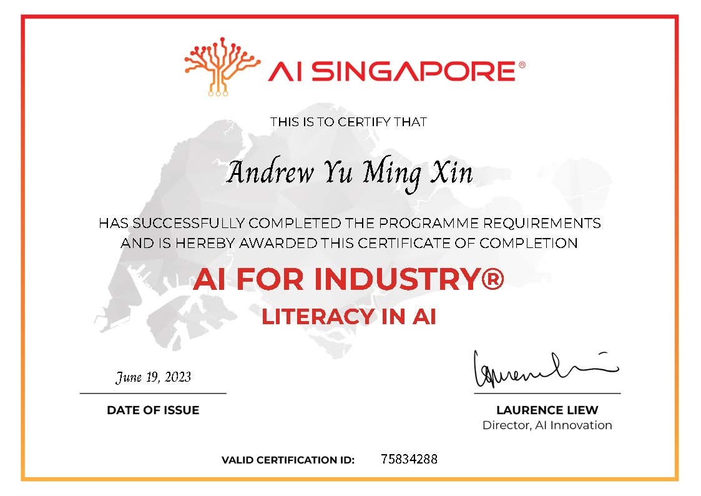
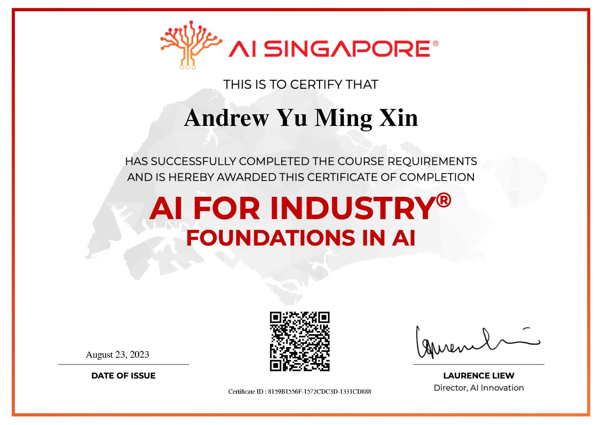
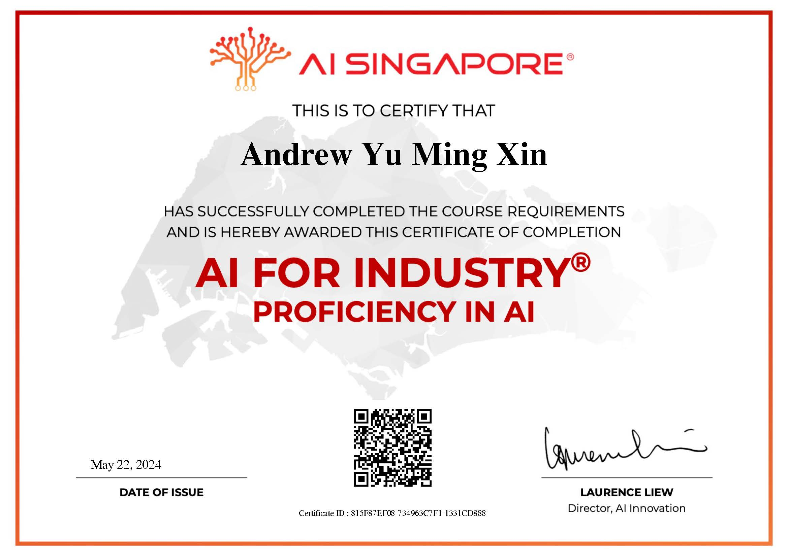

Learnt about ethics in AI
- [Model AI Governance Framework](https://www.pdpc.gov.sg/-/media/files/pdpc/pdf-files/resource-for-organisation/ai/sgmodelaigovframework2.pdf)
- Empathizing with people providing data, potentially negatively impacted users, different user subgroups
```
Levels of Human Involvement: Human-in-the-loop, Human-over-the-loop, Human-out-of-the-loop
                             --> ⬆️ use, risk of AI harm
Human-in-the-loop: Human must take affirmative action, AI only provides recommendations
Human-over-the-loop: Human able to monitor all decisions, Human override is easy, AI makes decisions
Human-out-of-the-loop: Human cannot easily override, AI takes full control
```
- Data Assessment: What/How/When data collected, what is missed out/over-represented? Eg. Biased data creates biased models
- De-identify data (mask/delete fields like name, address, etc), Restrict data access
- Test models thoroughly, across different subgroups Eg. Race, Gender, Age, Socio-economic status






