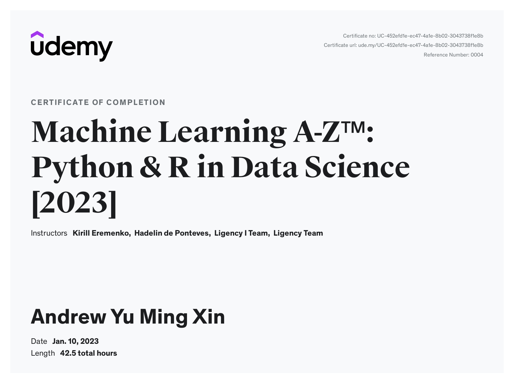

This certificate above verifies that Andrew Yu Ming Xin successfully completed the course
[Machine Learning A-Z™: Python & R in Data Science 2023](https://www.udemy.com/course/machinelearning/) on 01/10/2023 as taught by Kirill Eremenko, Hadelin de Ponteves, Ligency I Team, Ligency Team on Udemy.
The certificate indicates the entire course was completed as validated by the student. 
The course duration represents the total video hours of the course at time of most recent completion.

- [Part_1_Data_Preprocessing](Part_1_Data_Preprocessing): 
```
Missing Data Manipulation: SimpleImputer
.fit, .transform, .fit_transform
Encoding Categorical Data: ColumnTransformer + OneHotEncoder, LabelEncoder
Splitting Dataset: train_test_split
Feature Scaling: StandardScaler, NormalScaler, inverse_transform
```
- [Part_2_Regression](Part_2_Regression): 
```
Simple Linear Regression: Assumptions, scatterplot, .coef_, .intercept_
Multiple Linear Regression
Polynomial Linear Regression: PolynomialFeatures
Support Vector Regression (SVR): SVR, kernel
Regression Decision Tree: DecisionTreeRegressor
Regression Random Forests: RandomForestRegressor
XGBoost: XGBRegressor
CatBoost: CatBoostRegressor
```
- [Part_3_Classification](Part_3_Classification): 
```
confusion_matrix, accuracy_score
Logistic Regression: Assumptions, LogisticRegression, .predict/predictproba
K-Nearest Neighbors (K-NN): KNeighborsClassifier
Support Vector Machine (SVM): SVC
Naive Bayes (NB) Probability Model: GaussianNB
Classification Decision Tree: DecisionTreeClassifier
Classification Random Forests: RandomForestClassifier
XGBoost: XGBClassifier
CatBoost: CatBoostClassifier
```
- [Part_4_Clustering](Part_4_Clustering): 
```
Standard K-Means, K-Means++: KMeans, .inertia_, .fit_predict, .cluster_centers_
Agglomerative Hierarchical: .dendrogram, .linkage, AgglomerativeClustering
Divisive Hierarchical: 
Mean Shift
Density based
```
- [Part_5_Association_Rule](Part_5_Association_Rule): 
```
Apriori: apriori
Eclat: apriori
```
- [Part_6_Reinforcement_Learning](Part_6_Reinforcement_Learning): 
```
Upper Confidence Bound (UCB) (Deterministic)
Thompson Sampling (Probabilistic)
```
- [Part_7_Natural_Language_Processing](Part_7_Natural_Language_Processing): 
```
Bag of Words: CountVectorizer
```
- [Part_8_Deep_Learning](Part_8_Deep_Learning): 
```
ANN, Activation functions, Optimizers: .Sequential, .Dense, .add, .compile
CNN, Convolution+ReLU Layer, Pooling, Flattening, Fully Connection: ImageDataGenerator, .flow_from_directory, .Conv2D, .Flatten, image.img_to_array, image.load_img, np.expand_dims 
RNN: 
Self Organizing Maps: 
Deep Boltzmann Machines: 
Auto Encoders: 
```
- [Part_9_Dimensionality_Reduction](Part_9_Dimensionality_Reduction): 
```
Feature Selection: All-in, Score Comparison, Forward Selection, Backward Elimination, Bidirectional Elimination/Stepwise Regression
Feature Extraction: PCA, Linear Discriminant Analysis (LDA), Kernel PCA, Quadratic Discriminant Analysis (QDA)
```
- [Part_10_Model_Selection](Part_10_Model_Selection): 
```
Model Evaluation: K-Fold Cross Validation
Model Tuning: Grid Search
```
