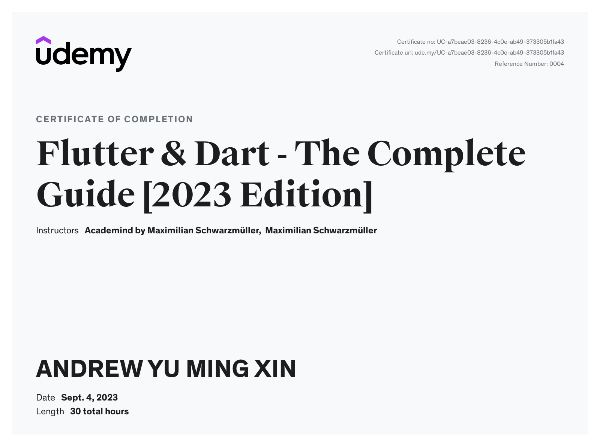

This certificate above verifies that ANDREW YU MING XIN successfully completed the course [Flutter & Dart - The Complete Guide [2023 Edition]](https://nlbsg.udemy.com/course/learn-flutter-dart-to-build-ios-android-apps/) on 09/04/2023 as taught by Academind by Maximilian Schwarzmüller, Maximilian Schwarzmüller on Udemy. The certificate indicates the entire course was completed as validated by the student. The course duration represents the total video hours of the course at time of most recent completion.

### [exercise_1_dice_roll](exercise_1_dice_roll): 
```
- Flutter is UI Framework for cross-platform (Android, IOS, Web, Windows, macOS, Linux) powered by Dart language, natively compiled. However, need macOS for IOS + macOS, for Appstore. Windows for Android + Web
- Flutter creates UI by nesting widgets (widget tree), inside runApp(), inside main(), which gets executed automatically by Dart
- varName, functionName, ClassName, file_name.dart conventions

- const is immutable compile-time constant
- final is mutable run-time constant
- var

- Primitive Object, Bool, String, num, int, double
- Complex Widgets

- WidgetType widget1(positionalParameter, [b], [c = 5]) {...}
- WidgetType widget1({ namedParameter1, namedParameter2 = 5 }) {...}
- WidgetType widget1(a, {required b}) {...}

- Classes, setState, "${}"
```
#### +Widgets used: 
- [Scaffold (Base screen)](exercise_1_dice_roll/lib/main.dart)
- [Container, BoxDecoration, LinearGradient, Center, Column, TextButton, Image.file/network/asset (Show image from file/url)](exercise_1_dice_roll/lib/dice_roller.dart)

#### Classes used: 
- [StatelessWidgets](exercise_1_dice_roll/lib/gradient_container.dart)
- [StatefulWidget, Alignment, MainAxisSize, EdgeInsets (all, symmetric, LTRB, only), Colors.black/Color.fromARGB/Color(8-digit hexadecimal/FF...6-digit hexadecimal), TextStyle, Text](exercise_1_dice_roll/lib/dice_roller.dart)


### [exercise_2_quiz](exercise_2_quiz): 
```
- Opacity is performance-intensive! use alpha in Color.fromARGB(150, 255, 255, 255) instead
- Alternative constructors Eg. OutlinedButton vs OutlinedButton.icon for icon
- Container(padding:..., margin:...) = Padding(padding:...) widget, 
- Installing 3rd party packages (GoogleFonts)
- Getters: "getting a value", used as a property, internally is a method
- .shuffle() to randomly shuffle mutate in-place, List.of(...) to create copy of list, .add(), .map(), .where(), Map<keyType, valueType>, Map typecasting as Dart doesn't know type of value in Map Eg. data["qn_index"] as int
```
#### +Widgets used: 
- [SizedBox (spacing)](exercise_2_quiz/lib/home_screen.dart)
- [RoundedRectangleBorder](exercise_2_quiz/lib/ans_btn.dart)
- [SizedBox + SingleChildScrollView (for scrollable window, ensure all on screen is scrollable, physics: BouncingScrollPhysics() for bouncy effect)](exercise_2_quiz/lib/qns_summary/qns_summary.dart)

#### Classes used: 
- [BorderRadius](exercise_2_quiz/lib/ans_btn.dart)
- [CrossAxisAlignment](exercise_2_quiz/lib/qns_screen.dart)
- [Icons](exercise_2_quiz/lib/results_screen.dart)


### [exercise_3_expense_tracker](exercise_3_expense_tracker): 
```
- DateTime, Category, 
- IOS vs Android Dialog Responsiveness
- Portrait vs Landscape Orientation Responsiveness
- Futures (Promises), Async Await Eg. Adding item
- Theming (.copyWith(...), .of(context) from ThemeData)
- 3rd party (uuid (unique ids), intl (date formatter))
```
#### +Widgets used: 
- [showModalBottomSheet (Overlay), ScaffoldMessenger, SnackBar + SnackBarAction (Eg. Undo notification), AppBar (Row Toolbar at top), Chart](exercise_3_expense_tracker/lib/widgets/expenses.dart)
- [Expanded (use when 2 nested widgets are unconstrained by space), CupertinoAlertDialog (IOS native), AlertDialog (Android),  LayoutBuilder (constraints based on parent widget), DropdownButton, DropdownMenuItem, Navigator.push/pushReplacement/pop(context, {...}) (Add/Replace/Remove overlay (return to prev screen) & pass info along), TextField (input field)](exercise_3_expense_tracker/lib/widgets/new_expense.dart)
- [ListView.builder (Scrollable List, BUT only create when visible (scrolled into view) for performance), Dismissible](exercise_3_expense_tracker/lib/widgets/expenses_list/expenses_list.dart)
- [FractionallySizedBox](exercise_3_expense_tracker/lib/widgets/chart/chart_bar.dart)

#### Classes used: 
- [Enum](exercise_3_expense_tracker/lib/models/expense_model.dart)
- [ColorScheme.fromSeed(...), Brightness, WidgetsFlutterBinding, SystemChrome, DeviceOrientation, ThemeData, CardTheme, ElevatedButtonThemeData, AppBarTheme, CardTheme, ThemeMode](exercise_3_expense_tracker/lib/main.dart)
- [MediaQuery (Eg. Keyboard overlap bottom), TextEditingController (manage memory storage of input field, .text, .dispose/clear()), Platform.is..., TextInputType (Keyboard type for email/numbers)](exercise_3_expense_tracker/lib/widgets/expenses.dart)
- [ValueKey](exercise_3_expense_tracker/lib/widgets/expenses_list/expenses_list.dart)


### [exercise_4_meals_app](exercise_4_meals_app): 
```
- late
- Cross-widget/App-wide state
- Explicit, Implicit Animations
- 3rd party (riverpod (Manage cross-widget state instead of passing states thru widgets that don't use it))
```
#### +Widgets used: 
- [Drawer (Hamburger icon Sidebar)](exercise_4_meals_app/lib/widgets/main_drawer.dart)
- [BottomNavigationBar (Tab bar at bottom), BottomNavigationBarItem](exercise_4_meals_app/lib/screens/tabs.dart)
- [Card, GestureDetector (Screen actions Eg. make tappable, drag), InkWell(GestureDetector + give visual feedback), Stack(Eg. text (child) on image (parent), starting with bottom (most background) layer), Hero (Animate widget across diff screens, need to be tagged same for connection), Positioned ( how child should be positioned RELATIVE to parent on stack)](exercise_4_meals_app/lib/widgets/meal_item.dart)
- [ListTile (Outputting any type List as a row)](exercise_4_meals_app/lib/widgets/main_drawer.dart)
- [SwitchListTile (Row of switches), AnimatedSwitcher, GridView (similar to ListView, but grids)](exercise_4_meals_app/lib/screens/meal_details.dart)

#### Classes used: 
- [ProviderScope](exercise_4_meals_app/lib/main.dart)
- [ConsumerStatefulWidget + ConsumerState, ref.watch(PROVIDER) (read again whenever value changes, like JS hooks), ref.read(PROVIDER.notifier)... (read once), StateNotifier(.state holds data, BUT cannot modify (.add/.remove) regardless, MUST alw create new data), StateNotifierProvider](exercise_4_meals_app/lib/providers)
- [FadeInImage (Fade in instead of popping in animation), MemoryImage (Image loaded from memory), NetworkImage (Image loaded from internet), BoxFit.cover (If image is too big to fit, it is cut off and zoomed in, not distorted), TextOverflow (What to replace with if text overflows, Eg. .ellipsis)](exercise_4_meals_app/lib/widgets/meal_item.dart)
- [WillPopScope (Detected when user taps back button (device/app))](exercise_4_meals_app/lib/screens/filters.dart)
- [MaterialPageRoute (Route into another screen), Rotation/SlideTransition (transition animation), Tween, AnimationController (late, .forward/.stop/.repeat, .dispose(), .value), AnimatedBuilder (Listen to animation), SliverGridDelegateWithFixedCrossAxisCount (Set no. of columns for GridView), CurvedAnimation (Non-linear animation)](exercise_4_meals_app/lib/screens/categories.dart)


### [exercise_5_shopping_list](exercise_5_shopping_list): 
```
- Form
- Backend & HTTP requests
- json.decode/encode
- !context.mounted (Check if referred context is outdated)
- 3rd party (http.get/post/put/patch/delete(...))
```
#### +Widgets used: 
- [CircularProgressIndicator (loading spinner), FutureBuilder (Updating UI based on state of Future)](exercise_5_shopping_list/lib/widgets/grocery_list.dart)
- [TextFormField/DropdownButtonFormField (TextField/DropdownButton for forms)](exercise_5_shopping_list/lib/widgets/new_item.dart)
#### Classes used: 
- [Uri.https(...), GlobalKey (for Forms, to get content inside Forms by .currentState.validate/save/reset())](exercise_5_shopping_list/lib/widgets/new_item.dart)


### [exercise_6_fav_places_app](exercise_6_fav_places_app): 
```
- Native Device Features (Camera, Device Storage, GPS location)
- Google Maps API
- Pathing + SQLite Database
```
#### +Widgets used: 
- [FutureBuilder (Takes a Future, returns single value, subscribes+rebuilds UI once with specified widget & ends)](exercise_6_fav_places_app/screens/places.dart)
#### Classes used: 
- [ImagePicker (Native Camera/Gallery)](exercise_6_fav_places_app/widgets/image_input.dart)


### [exercise_7_chat_app](exercise_7_chat_app): 
```
- Firebase Auth, Firestore, Cloud Storage, Messaging
```
#### +Widgets used: 
- [StreamBuilder (Takes a Stream (continuous flow of data Eg. real-time updates), subscribes+rebuilds UI with specified widget whenever any changes to Stream)](exercise_7_chat_app/widgets/chat_messages.dart)
- [MaterialApp(debugShowCheckedModeBanner: false) (Not show "debug" banner on emulator)](exercise_7_chat_app/main.dart)

#### Classes used: 
- [FirebaseAuth](exercise_7_chat_app/main.dart)
- [FirebaseFirestore](exercise_7_chat_app/widgets/new_message.dart)
- [FirebaseStorage](exercise_7_chat_app/screens/auth.dart)
- [FirebaseMessaging](exercise_7_chat_app/screens/chat.dart)


### [TikTokHackathon2023-TiktokShop](https://github.com/Gnoot01/TikTokHackathon2023-TiktokShop): 
```
- Get/Add/Update/Delete data: .then, Retrieve + use to build widget: FutureBuilder/StreamBuilder
```
#### +Widgets used: 
- [TabController (addListener if _tabController.index not updating in TabBarView for some reason), TabBar, TabBarView (for diff tabs)](https://github.com/Gnoot01/TikTokHackathon2023-TiktokShop/blob/main/lib/widgets/home/product_tabs.dart)
- [LinearProgressIndicator (Progress bar)](https://github.com/Gnoot01/TikTokHackathon2023-TiktokShop/blob/main/lib/widgets/quests/quest.dart)
- [ScrollablePositionedList (Scrollable list, navigate to clicked)](https://github.com/Gnoot01/TikTokHackathon2023-TiktokShop/blob/main/lib/widgets/tribes/your_tribes.dart)
- [GestureDetector(onVerticalDragUpdate: (details) { if (details.delta.dy < -5) {..}}) (Action on swipe-up)](https://github.com/Gnoot01/TikTokHackathon2023-TiktokShop/blob/main/lib/models/product_grid.dart)
- [VideoPlayerController, ChewieController](https://github.com/Gnoot01/TikTokHackathon2023-TiktokShop/blob/main/lib/screens/tribes/video_posts.dart)
- [Scaffold(extendBodyBehindAppBar: true) (Image behind Scaffold, esp Appbar part), BottomNavigationBar (Bottom tabs)](https://github.com/Gnoot01/TikTokHackathon2023-TiktokShop/blob/main/lib/screens/home/home.dart)
- [Divider (Like Container(color: ...))](https://github.com/Gnoot01/TikTokHackathon2023-TiktokShop/blob/main/lib/widgets/home/inbox_tab.dart)
#### Classes used: 
- BoxDecoration (Border/OutlineInputBorder, BorderRadius, clipBehavior, BoxShadow), InputDecoration (To decorate TextField input)
- [FocusScope.of(context).requestFocus(FocusNode()) + FocusScope.of(context).unfocus() (Close keyboard Eg. when tapping out of focus areas)](https://github.com/Gnoot01/TikTokHackathon2023-TiktokShop/blob/main/lib/screens/socialhub/fulfil_wishlist_selection.dart)
#### Async Await Firebase:
- [StreamBuilder QuerySnapshot + DocumentSnapshot](https://github.com/Gnoot01/TikTokHackathon2023-TiktokShop/blob/main/lib/models/product_grid.dart)
- [Updating value, nested QuerySnapshot -> DocumentSnapshot](https://github.com/Gnoot01/TikTokHackathon2023-TiktokShop/blob/main/lib/screens/socialhub/fulfil_wishlist_selection.dart)

