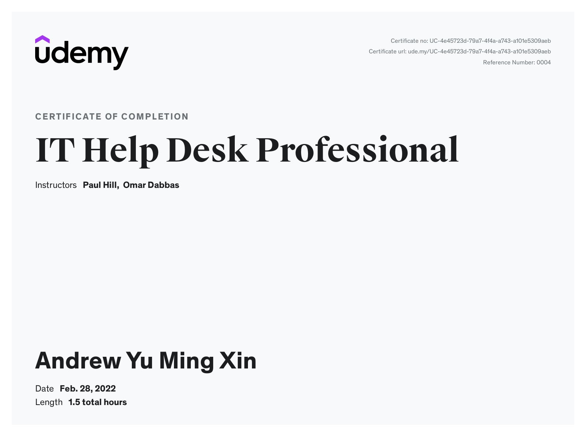
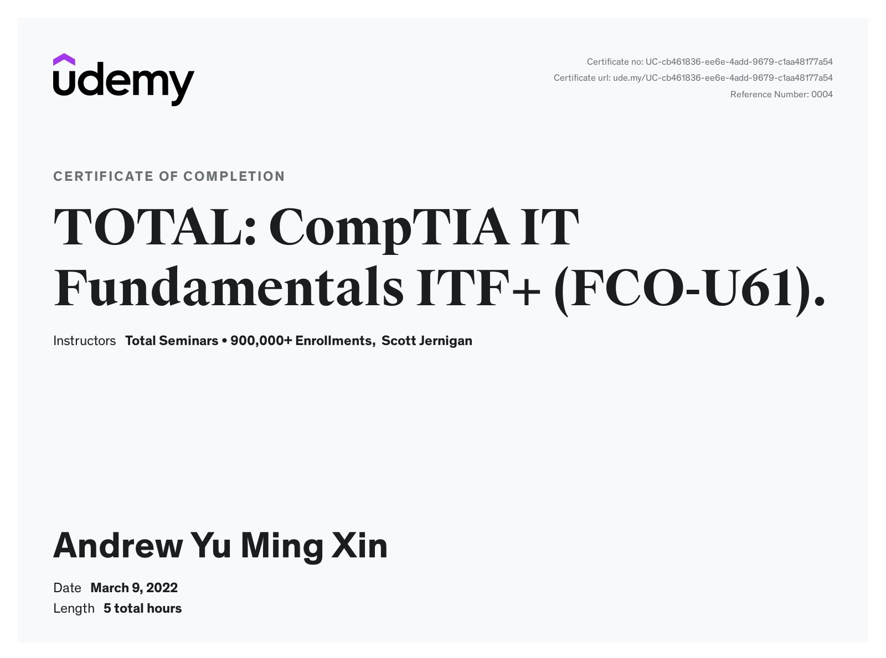
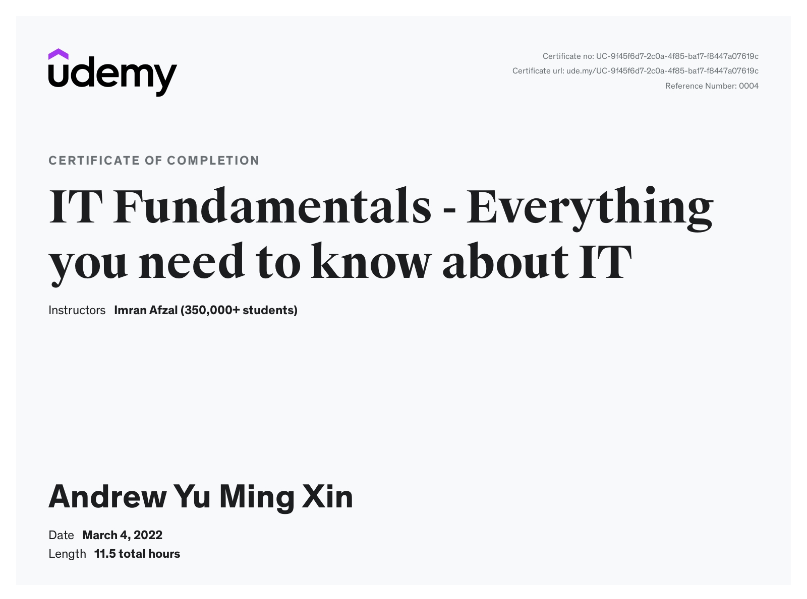
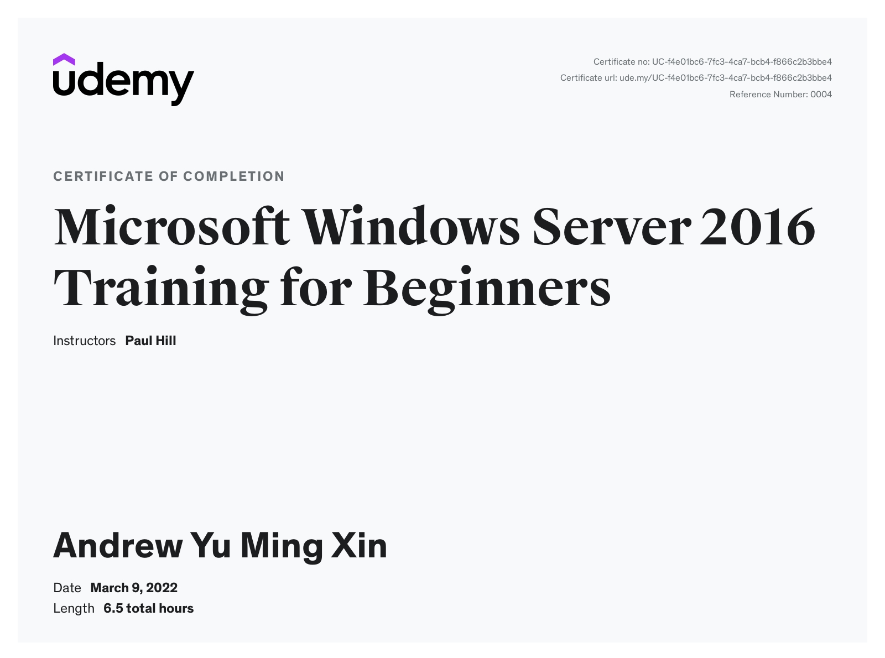

Tried to get as many legitimate credible IT sources and courses on Udemy as possible before applying for my first IT job. Although interested mainly in RPA and AI, in my current state
I know I am not ready for a full-on job or even internship yet in my desired field. As such, I want to delve into the other types of software OR hardware side of things and start wherever I can, 
to gain some expertise on providing IT tech support. I have always wondered how my school's laptops were configured (whenever I was locked out and had to reset my password / why I need to change my password
to something of similar length and pattern as the pre-set one) and how WiFi, ports, printers worked and how to set up / fix them in future if I needed to.

This certificate above verifies that Andrew Yu Ming Xin successfully completed the course IT Help Desk Professional on 02/28/2022 as taught by Paul Hill, Omar Dabbas on Udemy. 
The certificate indicates the entire course was completed as validated by the student. 
The course duration represents the total video hours of the course at time of most recent completion.

An extremely basic barebones course, my initial foray and rough introduction into the computer hardware, and system administration world.
- Machine Naming, Workgroup & Domain Join
- Dynamic Host Config Protocol (DHCP) vs Static IP
- Active Directory
- Printers
- Basic Troubleshooting

This certificate above verifies that Andrew Yu Ming Xin successfully completed the course TOTAL: CompTIA IT Fundamentals ITF+ (FCO-U61). on 03/09/2022 as taught by Total Seminars • 900,000+ Enrollments, Scott Jernigan on Udemy. 
The certificate indicates the entire course was completed as validated by the student. 
The course duration represents the total video hours of the course at time of most recent completion.

Mostly about teaching how computers work, and how to use them. Touch-and-go at times. Not a very informative course, but I still finished it, as it was engaging at least, speeding up some parts I already knew.
Explains certain concepts very well, more suited for more senior/very young.
- More components of computer hardware (CPU, GPU, RAM, Motherboard)
- HID, Ports, Peripherals
- Storage variations 
- Security
- Computer Maintenance
- Troubleshooting & Problem-Solving

This certificate above verifies that Andrew Yu Ming Xin successfully completed the course IT Fundamentals - Everything you need to know about IT on 03/04/2022 as taught by Imran Afzal (350,000+ students) on Udemy. 
The certificate indicates the entire course was completed as validated by the student. 
The course duration represents the total video hours of the course at time of most recent completion.

Very in-depth and thorough. Expanded my knowledge on the big over-arching themes in IT (Computers, Operating Systems, Network, Storage, Database, Virtualization+Cloud, Troubleshooting,
Scripting via PowerShell/Linux Terminal (DevOps), System Administration)
- How each computer hardware component actually looks like, and its location in the computer itself
- Windows, Mac, Linux OS (CLI vs GUI), BIOS vs UEFI
- TCP/IP, Gateway, Subnet Mask, MAC, LAN vs MAN vs WAN, Network Devices (Hub, Switch, Modem, Router, Access Point)
- RAM, SWAP, Virtual Memory, Cache, HDD vs SSD, SATA vs SAS, RAID (0 vs 1 vs 5)
- Virtualization & Cloud definitions, similarities and differences, Hypervisor:Cloud -Oracle's VirtualBox:OCI, VMWare:vCloud, Hyper-V:Azure
- Windows FileSystems, Server, Server Manager, Device Manager, Roles and Features, Domain Controller and AD
- Linux FileSystems, CentOS, Putty,  utility (date, uptime, hostname, uname, which, cal, bc), monitoring (op, df, dmesg, iostat 1, netstat, free) and maintenance (shutdown, reboot, halt, init) cmds
- Troubleshooting via System, Event logs

 
This certificate above verifies that Andrew Yu Ming Xin successfully completed the course Microsoft Windows Server 2016 Training for Beginners on 03/09/2022 as taught by Paul Hill on Udemy. 
The certificate indicates the entire course was completed as validated by the student. 
The course duration represents the total video hours of the course at time of most recent completion.

Extremely thorough deep-dive on System Administration. 
- Domain Controller
- DHCP
- DNS Server
- AD
- AD Sites and Services
- GP
- WSUS
- Powershell Scripting
- Windows Server Backup
- Domain Trusts

Fills in the gaps of the previous course. Expounds further, reinforces on
- Print Server Management
- File Server Management
- Data Deduplication
- Windows Deployment Service (WDS)
- Network Load Balancing (NLB), a somewhat challenging concept for me to grasp

- to learn
